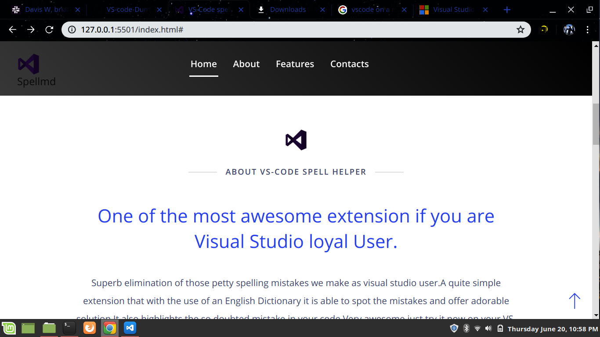

# The Spellmd
#### This is a quite simple VS extension that is still under development.As a school project this is one of the most awesome applications to ever design as a student that checks spelling using a dictionary.
#### Developers:
Regards to the Moringa group Z that came up with spell checker.
## Description
  **Simple Visual Studio code extension that has capabilty to detect any misspell using a dictionary.This a school project that we did as at school.**

**Here is a screen shot of  the  project;**

## Setup/Installation Requirements
* You'll need to clone this first, here is a guideline:
## Installation Guide.
To start using this project use the following commands:

- `git clone https://github.com/lamechy/VS-code-Dummy-ext.git`
- `cd VS-code-Dummy-ext`
- `atom .`
- `code .`
## Known Bugs
Absolutely no known bugs.
## Technologies Used
**HTML**
**JavaScript**
**CSS**
**Bootstrap**
**JQuery**
**Fonts**

## Support and contact details
You can contact us via:
Email: lamechongondi88@gmail.com
Never walk alone.

### License
